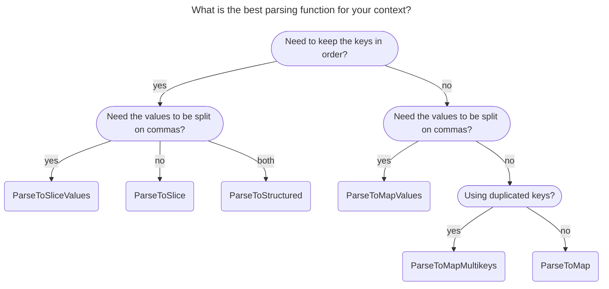

# StructTags

`structtags` provides several ways of parsing struct tags.

- Some projects need a full parsing (key, values)
- Some others only need the key and the raw value.
- Other projects need to escape the comma.
- Etc.

This is the first version of the module, and I want to extend it based on feedback so that the API can evolve and break.

## Usage



### `structtags.ParseToMap(tag, ...options)`

Parses a struct tag to a `map[string]string`.

[Example](https://pkg.go.dev/github.com/ldez/structtags#example-ParseToMap)

Options:
- `WithDuplicateKeysMode`:
  - `DuplicateKeysIgnore` (default)
  - `DuplicateKeysDeny`

### `structtags.ParseToMapValues(tag, ...options)`

Parses a struct tag to a `map[string][]string`.

The value is split on a comma.

[Example](https://pkg.go.dev/github.com/ldez/structtags#example-ParseToMapValues)

Options:
- `WithEscapeComma`: Comma escaped by backslash.
- `WithDuplicateKeysMode`:
  - `DuplicateKeysIgnore` (default)
  - `DuplicateKeysDeny`
  - `DuplicateKeysAllow` (non-conventional, so not recommended)

### `structtags.ParseToMapMultikeys(tag)`

NOT RECOMMENDED.
For non-conventional tags where the key is repeated.

Parses a struct tag to a `map[string][]string`.

[Example](https://pkg.go.dev/github.com/ldez/structtags#example-ParseToMapMultikeys)

### `structtags.ParseToSlice(tag, ...options)`

Parses a struct tag to a slice of `type Tag struct { Key, Value string }`.

[Example](https://pkg.go.dev/github.com/ldez/structtags#example-ParseToSlice)

Options:
- `WithDuplicateKeysMode`:
  - `DuplicateKeysIgnore` (default)
  - `DuplicateKeysDeny`
  - `DuplicateKeysAllow` (non-conventional, so not recommended)

### `structtags.ParseToSliceValues(tag, ...options)`

Parses a struct tag to a slice of `type Tag struct { Key string, Value []string }`.

The value is split on a comma.

[Example](https://pkg.go.dev/github.com/ldez/structtags#example-ParseToSliceValues)

Options:
- `WithEscapeComma`: Comma escaped by backslash.
- `WithDuplicateKeysMode`:
  - `DuplicateKeysIgnore` (default)
  - `DuplicateKeysDeny`
  - `DuplicateKeysAllow` (non-conventional, so not recommended)

### `structtags.ParseToStructured(tag, ...options)`

Parses a struct tag to a `*structured.Tag`.

The value is split on a comma.

The value is parsed lazily: only if you call `Entry.Values()`

[Example](https://pkg.go.dev/github.com/ldez/structtags#example-ParseToStructured)

Options:
- `WithEscapeComma`: Comma escaped by backslash.
- `WithDuplicateKeysMode`:
  - `DuplicateKeysIgnore` (default)
  - `DuplicateKeysDeny`
  - `DuplicateKeysAllow` (non-conventional, so not recommended)

### `structtags.ParseToFatih(tag, escapeComma)`

Parses a struct tag to a `*structtag.Tags`.

The value is split on a comma.

Option: comma escaped by backslash.

### Custom Parser

The `parser` package provides the tooling to parse a struct tag and its associated value.

To implement a custom parser, you can implement the `parser.Filler` interface.

## Why this library?

[`reflect.StructTag`](https://pkg.go.dev/reflect#StructTag) is great but:
- It doesn't allow extracting all keys or iterating on them.
- It doesn't allow modifying the struct tags.
- It doesn't provide methods to split the values on comma.
- It doesn't allow getting non-conventional duplicated keys.

[`fatih/structtag`](https://github.com/fatih/structtag) is a great library, but it's not extensible, it was built around JSON tags, and it was designed to modify tags.

For example, the [`Tag`](https://github.com/fatih/structtag/blob/2977b8db49bbf5ae2e0ae2be55e43d2c1798fc03/tags.go#L26-L39) struct inside `fatih/structtag` that represents a tag is:

<details>

```go
type Tag struct {
    // Key is the tag key, such as json, xml, etc..
    // i.e: `json:"foo,omitempty". Here key is: "json"
    Key string
    
    // Name is a part of the value
    // i.e: `json:"foo,omitempty". Here name is: "foo"
    Name string
    
    // Options is a part of the value. It contains a slice of tag options i.e:
    // `json:"foo,omitempty". Here options is: ["omitempty"]
    Options []string
}
```

</details>

`Name` and `Options` are related to JSON tags (and other marshaling/unmarshalling libraries).

But the first element in a struct tag value is not necessarily a name.

<details>
<summary>Example</summary>

```go
type Foo struct {
  Field1 float64  `minimum:"10.5" example:"20.6" required:"true"`
  Field2 string   `jsonschema:"required"`
  Field3 string   `description:"This is a description"`
}
```

</details>

Also, most projects don't need to modify the struct tags, but only to read them.

There are some limitations with `fatih/structtag` when there is comma inside the value.

<details>
<summary>Example</summary>

```go
type Foo struct {
  Field1 string   `regexp:"[a-z\\,.]"`
}
```

</details>

`ldez/structtags` provides straightforward ways to parse, read, or modify struct tags, and a compatibility layer with `fatih/structtag` if you need it.

Instead of rewriting the wheel for each project, I also provided a package with the plumbing:
- `parser.Tag()`: extracted from `reflect.StructTag` for the base parsing.
- `parser.Value()`: to parse the value (support optional comma escaping).

## Notes

The [struct tag specifications](https://go.dev/ref/spec#Struct_types) say that struct tags can be any string.

The key/value syntax, the comma separator, and the space separator are conventions based on [`reflect.StructTag`](https://pkg.go.dev/reflect#StructTag) and `json` implementation.

`reflect.StructTag` behaves like the struct tags are `map[string]string`, but with one difference:
The first key always wins if there are multiple keys with the same name.

We can say that the `reflect.StructTag` doesn't support multiple keys with the same name.
But some rare projects/libraries use multiple keys with the same name.

Also, the specification doesn't talk about comma escaping inside the value.

Maybe the specification should clarify those points.

## References

- https://go.dev/ref/spec#Struct_types
- https://go.dev/ref/spec#string_lit
- https://pkg.go.dev/reflect#StructTag
- https://github.com/golang/go/blob/411c250d64304033181c46413a6e9381e8fe9b82/src/reflect/type.go#L1030-L1108
- https://github.com/golang/tools/blob/master/go/analysis/passes/structtag/structtag.go
- https://github.com/fatih/structtag/blob/master/tags.go
